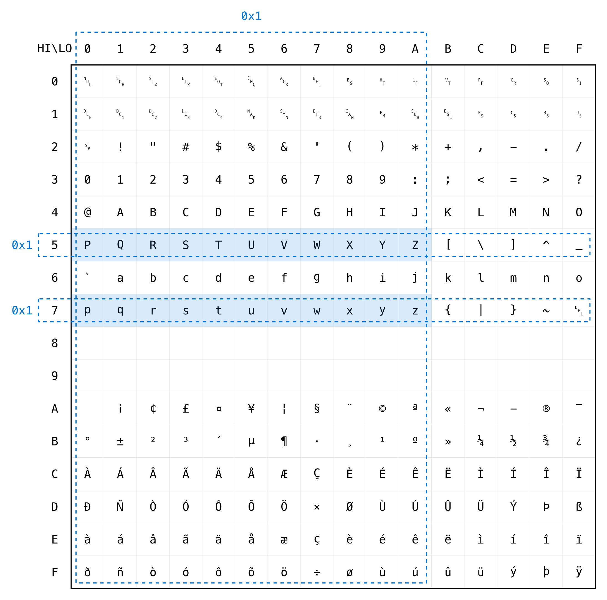

# ASCII Matrix

ASCII Matrix displays a pretty 16x16 grid that contains ASCII characters (as well as extra characters in Latin-1) and allows users to specify which rectangular frames or masks should be drawn over the elements.

## Usage

```typst
#import "@preview/ascii-matrix:0.1.0": make-ascii-matrix

#set text(
  font: (
    (name: "Arial Unicode MS", covers: regex("[\u2400-\u243f]")),
    "Menlo", // macOS
    "Consolas", // Windows
    "DejaVu Sans Mono", // Linux
    "Roboto Mono", // Android
  ),
  size: 10pt,
  fallback: true,
)

#set page(width: auto, height: auto, margin: 1em)

#let frames = (
  ("col", 0, 10, blue, "0x1"),
  ("row", 5, 5, blue, "0x1"),
  ("row", 7, 7, blue, "0x1"),
)

#let masks = (
  ((0, 5), (10, 5), blue.transparentize(85%)),
  ((0, 7), (10, 7), blue.transparentize(85%)),
)

#make-ascii-matrix(frames, masks)
```

This produces the following diagram:


